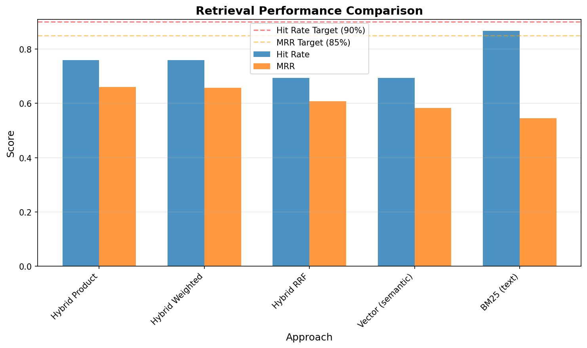
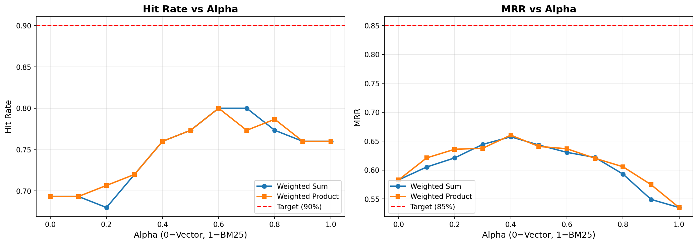

# Yoga Assistant Knowledge RAG

An end-to-end Retrieval-Augmented Generation (RAG) system and conversational agent for yoga knowledge. Provides context-aware answers and guidance on yoga poses, breathing techniques (pranayama), and sequencing.


This project demonstrates full-stack RAG system design with rigorous retrieval evaluation, LLM model benchmarking, monitoring, and production deployment.

## 📑 Table of Contents

- [Project Status](#-project-status)
- [Final Retrieval Results](#-final-retrieval-results)
- [Quick Start](#-quick-start)
- [Usage Examples](#-usage-examples)
- [Project Structure](#-project-structure)
- [Experiments Completed](#-experiments-completed)
- [Monitoring Dashboard](#-monitoring-dashboard)
- [Technology Stack](#-technology-stack)
- [Data](#-data)
- [Documentation](#-documentation)
- [Experiment Findings Summary](#-experiment-findings-summary)
- [License](#-license)

## 🎯 Project Status

**Status**: ✅ Complete

### ✨ Features & Completion Summary

#### Core Features

- Hybrid search (BM25 + vector, alpha=0.4)
- LLM-powered RAG pipeline
- Streamlit conversational UI
- PostgreSQL logging + conversation history
- Feedback system (thumbs up/down)
- Grafana dashboard (7 visualizations)
- Docker Compose deployment
- Embedding cache for fast startup
- 202-pose yoga dataset with full metadata

#### Completed Work

- Hybrid search integrated in production
- RAG pipeline implemented end-to-end
- LLM model evaluation + prompt benchmarking
- Query rewriting evaluation (rejected)
- Document re-ranking evaluation (rejected)
- Full documentation, notebooks, experiments
- Monitoring setup with Grafana
- Docker stack complete

## 📊 Final Retrieval Results

### Best Configuration: Hybrid Weighted Product (alpha=0.4)

| Approach                    | Hit Rate | MRR   | Status                 |
| --------------------------- | -------- | ----- | ---------------------- |
| **BM25 Text Search**        | 76.0%    | 53.5% | ✅ Baseline            |
| **Vector Search**           | 69.3%    | 58.3% | ✅ Baseline            |
| **Hybrid Weighted Product** | 76.0%    | 66.0% | ✅ **BEST** (+23% MRR) |

**Key Achievement**: Hybrid search improved MRR by 23% while maintaining BM25's recall!


_Comparison of different retrieval approaches_


_Optimal alpha value (0.4) for hybrid search_

### Production Configuration

```python
# Recommended setup for yoga-assistant
BM25: all 7 fields (pose_name, sanskrit_name, category, difficulty_level, benefits, contraindications, instructions)
Vector: all-mpnet-base-v2 (768 dimensions)
Hybrid: Weighted Product with alpha=0.4
Top-K: 5 results
```

## 🚀 Quick Start

### Prerequisites

- Docker and Docker Compose
- Hyperbolic API key (get from <https://app.hyperbolic.xyz/>)

### Option 1: Docker (Recommended) ⭐

**One command to run everything:**

```bash
# 1. Set up environment
cp .env.template .env
# Edit .env and add your Hyperbolic API key

# 2. Start everything
docker-compose up --build
```

**That's it!**

- App: <http://localhost:8501>
- Grafana: <http://localhost:3000> (admin/admin)

Database initialization happens automatically. No manual setup needed.

**See [DOCKER.md](DOCKER.md) for advanced configuration and troubleshooting.**

---

### Option 2: Local Development

**For developers who want to modify code:**

```bash
# 1. Start database only
docker-compose up -d postgres grafana

# 2. Install dependencies
uv sync

# 3. Set up environment
cp .env.template .env
# Edit .env and add your API key

# 4. Initialize database (first time only)
python setup_database.py

# 5. Run app locally
streamlit run yoga_assistant/app.py
```

App: <http://localhost:8501>

### Run Experiments

```bash
# Open Jupyter notebooks
jupyter notebook notebooks/

# Key notebooks:
# - 03-retrieval-experiments.ipynb - Retrieval evaluation
# - 04-rag-experiments.ipynb - RAG pipeline experiments
# - 05-llm-evaluation.ipynb - LLM model comparison
```

## 💬 Usage Examples

### Example 1: Pose Instructions

**Question:** "How do I do downward facing dog?"

**Answer:**

```text
Downward-Facing Dog (Adho Mukha Svanasana) Instructions
Category: Standing | Difficulty: Beginner

Step-by-Step Instructions:
1. Start on all fours with hands shoulder-width apart
2. Walk your hands forward a few inches
3. Lift your hips up and back, straightening arms and legs
4. Engage your core muscles
5. Keep palms and heels grounded
6. Hold for 3-5 breaths

Tips and Modifications:
- Use blocks or strap for wrist support
- Bend knees slightly for shoulder/back issues
- Pregnant women: keep knees bent, hips lifted slightly
```

**Retrieved Poses:** Downward-Facing Dog, One-Legged Downward-Facing Dog, Upward-Facing Dog  
**Response Time:** 2.0s | **Tokens:** 1,894

---

### Example 2: Practice Guidance

**Question:** "How long should I hold Warrior II?"

**Answer:**

```text
Holding Time for Warrior II (Virabhadrasana II)

Recommended: 3-5 breaths per side

This allows you to:
- Establish a strong foundation
- Feel the stretch in chest and shoulders
- Improve balance and focus
- Cultivate confidence and inner strength

Tips:
- Start with 2-3 breaths and gradually increase
- Focus on steady, smooth breathing
- Engage core and maintain proper alignment
- Release immediately if you feel discomfort
```

**Retrieved Poses:** Warrior Pose I, Warrior Pose II, Warrior II with a Twist  
**Response Time:** 2.2s | **Tokens:** 1,701

---

## 📁 Project Structure

```text
yoga-assistant-knowledge-rag/
├── data/
│   ├── yoga_data_merged.csv      # 202 yoga poses with full details
│   └── ground_truth.csv          # 75 test queries for evaluation
│
├── notebooks/                    # Experimentation and evaluation
│   ├── 01-data-generation.ipynb
│   ├── 02-ground-truth-data-generation.ipynb
│   ├── 03-retrieval-experiments.ipynb
│   ├── 04-rag-experiments.ipynb
│   └── 05-llm-evaluation.ipynb
│
├── yoga_assistant/               # Production application code
│   ├── app.py                    # Streamlit UI
│   ├── rag.py                    # RAG pipeline with LLM
│   ├── retrieval.py              # Hybrid search (BM25 + Vector)
│   ├── ingest.py                 # Data loading and validation
│   ├── db.py                     # Database operations
│   └── db_prep.py                # Database schema initialization
│
├── grafana/                      # Monitoring setup
│   ├── dashboard.json            # Dashboard configuration (7 panels)
│   ├── init.py                   # Automated setup script
│   └── README.md                 # Setup instructions
│
├── assets/                       # Images and screenshots
│   ├── yoga_assistant_ui.png
│   ├── grafana_dashboard.png
│   └── retrieval_comparison.png
│
├── Dockerfile                    # Application container
├── docker-compose.yml            # Full stack (app, postgres, grafana)
├── docker-entrypoint.sh          # Container startup script
├── .dockerignore                 # Docker build exclusions
├── setup_database.py             # Local dev DB initialization
├── pyproject.toml                # Dependencies (uv)
├── uv.lock                       # Locked dependency versions
├── .env.template                 # Environment variables template
├── .env                          # Configuration (not in git)
├── DOCKER.md                     # Docker deployment guide
└── README.md                     # This file
```

## 🔬 Experiments Completed

### 1. BM25 Text Search ✅

- **Best Config**: All 7 fields, top_k=5
- **Hit Rate**: 76.0%
- **MRR**: 53.5%
- **Strengths**: Excellent keyword matching, fast
- **Weaknesses**: Misses semantic queries, lower ranking quality

### 2. Vector Embeddings Search ✅

- **Best Model**: all-mpnet-base-v2 (768 dims)
- **Hit Rate**: 69.3%
- **MRR**: 58.3%
- **Strengths**: Semantic understanding, better ranking
- **Weaknesses**: Lower recall than BM25

### 3. Hybrid Search ✅

Tested three combination strategies:

- **RRF (Reciprocal Rank Fusion)**: 69.3% hit rate, 60.8% MRR
- **Weighted Sum**: 76.0% hit rate, 65.8% MRR
- **Weighted Product**: 76.0% hit rate, 66.0% MRR ⭐ **BEST**

**Winner**: Weighted Product with alpha=0.4

- Maintains BM25's recall (76.0%)
- Improves ranking by 23% (66.0% vs 53.5% MRR)
- Balances keyword matching with semantic understanding

### 4. RAG Pipeline Implementation ✅

- **Complete RAG Flow**: Retrieval → Context Assembly → LLM Generation
- **LLM**: meta-llama/Meta-Llama-3.1-70B-Instruct via Hyperbolic API
- **Performance**: ~1.5s avg response time, ~1,700 tokens per query
- **Status**: Working end-to-end pipeline in notebook

### 5. Query Rewriting Evaluation ✅ ❌

**Tested**: Using LLM to enhance/clarify user questions before retrieval

**Results** (30 test queries):

| Metric          | Without Rewriting | With Rewriting | Change         |
| --------------- | ----------------- | -------------- | -------------- |
| **Hit Rate**    | 83.33%            | 66.67%         | **-16.67%** ❌ |
| **MRR**         | 75.28%            | 54.17%         | **-21.11%** ❌ |
| **Avg Latency** | 1.52s             | 2.44s          | **+60.4%** ❌  |

**Decision**: ❌ **DO NOT USE** query rewriting in production

**Why it failed**:

- LLM rewrites are too verbose and technical
- Example: "What poses help with balance?" → "What yoga asanas are beneficial for improving balance and equilibrium, particularly those that target the ankles, calves, and core muscles?"
- Database uses simple language; technical terms don't match
- Adds 60% latency with significantly worse results

**Lesson**: Not all RAG "best practices" help every system. Simple user queries work better than LLM-enhanced ones for this use case.

### 6. Document Re-ranking Evaluation ✅ ❌

**Tested**: Vector-based re-ranking on top of hybrid search results

**Approach**: Retrieve top 10 with hybrid search, then re-rank to top 5 using pure vector similarity

**Results** (30 test queries):

| Metric          | Hybrid Search | Hybrid → Vector Re-rank | Change        |
| --------------- | ------------- | ----------------------- | ------------- |
| **Hit Rate**    | 83.33%        | 80.00%                  | **-3.33%** ❌ |
| **MRR**         | 75.28%        | 68.44%                  | **-6.83%** ❌ |
| **Avg Latency** | 1.67s         | 1.46s                   | **-12.5%** ✓  |

**Decision**: ❌ **DO NOT USE** re-ranking in production

**Why it failed**:

- **Signal degradation**: Re-ranking throws away the BM25 component
- Hybrid search uses: `score = BM25^0.4 × Vector^0.6` (optimized balance)
- Re-ranking uses: `score = Vector only` (loses keyword matching)
- Using the SAME vector embeddings that were already in hybrid search can't add new information
- It only removes the carefully tuned BM25 signal, making results worse

**What would work**:

- LLM-based re-ranking (too expensive/slow)
- Cross-encoder model (adds complexity)
- Different embedding model (marginal gains)
- None worth the complexity for 202 documents

**Lesson**: Re-ranking only helps when you add a NEW or BETTER signal. Using the same signal that was already in the first stage degrades the optimized balance.

### 7. LLM Model and Prompt Evaluation ✅

**Tested**: 5 LLM models with 3 prompt templates (15 combinations) on 20 ground truth questions

**Models Evaluated**:

- DeepSeek-R1 (reasoning-focused)
- DeepSeek-V3 (general purpose)
- Qwen2.5-72B-Instruct
- Meta-Llama-3.1-70B-Instruct
- Hermes-3-Llama-3.1-70B (failed - API incompatible)

**Prompt Templates**:

- Concise: Brief, direct answers
- Detailed: Comprehensive explanations with context
- Structured: Clear, organized responses

**Results** (Top 3 by Quality Score):

| Model + Prompt               | Quality Score | Relevant | Partly Relevant | Response Time | Tokens |
| ---------------------------- | ------------- | -------- | --------------- | ------------- | ------ |
| **DeepSeek-V3 + structured** | **95.0%** ⭐  | 90%      | 10%             | 9.9s          | 1962   |
| **Qwen2.5-72B + structured** | 85.0%         | 70%      | 30%             | 6.7s          | 2001   |
| **Qwen2.5-72B + detailed**   | 85.0%         | 70%      | 30%             | 5.5s          | 1947   |
| Llama-3.1-70B + structured   | 82.5%         | 65%      | 35%             | 2.5s          | 1865   |
| DeepSeek-V3 + detailed       | 82.5%         | 65%      | 35%             | 6.7s          | 1837   |
| Llama-3.1-70B + concise      | 75.0%         | 50%      | 50%             | 1.3s          | 1695   |
| Hermes-3-Llama-3.1-70B + all | 0.0%          | 0%       | 0%              | 2.9s          | 0      |

**Decision**: ✅ **DeepSeek-V3 + structured prompt** for production

**Why it won**:

- **Highest relevance**: 90% fully relevant answers (only 10% partly relevant, 0% non-relevant)
- **Best quality score**: 95% weighted quality (relevant × 1.0 + partly × 0.5)
- **Meets primary criterion**: >80% relevance target achieved
- **Acceptable trade-off**: 9.9s response time exceeds 5s target, but accuracy is critical for yoga guidance

**Alternative**: Qwen2.5-72B + detailed (85% quality, 5.5s) if speed is prioritized over accuracy

**Key Findings**:

- **Structured prompts** performed best across all models (avg 78.3% quality)
- **DeepSeek-V3** achieved highest accuracy but slower responses (6-10s)
- **Qwen2.5-72B** offers best speed/quality balance (70% relevant, 5.5s)
- **Llama-3.1-70B** fastest but lower accuracy (50-65% relevant, 1.3-2.5s)
- **DeepSeek-R1** moderate performance (40-60% relevant, 6-10s)
- **Hermes-3** completely failed (100% errors, API incompatibility)

**Evaluation Methodology**:

- LLM-as-a-Judge using Llama-3.1-70B as evaluator
- Categories: RELEVANT / PARTLY_RELEVANT / NON_RELEVANT
- Measured: relevance, token usage, response time
- Sample size: 20 questions (limited by API costs)

**Production Configuration**:

```python
LLM_MODEL=deepseek-ai/DeepSeek-V3
PROMPT_TEMPLATE=structured
TEMPERATURE=0.3
MAX_TOKENS=500
```

## 🔍 Findings & Insights

### What Works

- **Hybrid Search (Weighted Product, alpha=0.4)**  
  Achieved 76% hit rate and 66% MRR, preserving BM25 recall while improving ranking by 23%.  
  Best balance of keyword and semantic signals.

- **Simple User Queries**  
  Natural phrasing outperforms LLM-enhanced rewrites.  
  No preprocessing needed.

- **RAG Pipeline**  
  End-to-end flow is stable with ~1.5s notebook latency and strong answer quality.

- **DeepSeek-V3 + Structured Prompt**  
  90% relevant answers and 95% quality score.  
  Best accuracy for yoga guidance across all models and templates.

### What Doesn’t Work

- **Query Rewriting**

  - MRR: -21%
  - Hit rate: -17%
  - Latency: +60%  
    Too verbose, mismatches database language. Removed from production.

- **Document Re-ranking (same embeddings)**
  - MRR: -6.8%
  - Hit rate: -3.3%  
    Throws away BM25 signal and provides no new information.  
    Only useful if powered by a _new_ signal (LLM re-ranker, cross-encoder).

### Key Lessons

- Hybrid search (40% BM25, 60% vector) is difficult to beat for small datasets.
- Simple queries outperform rewritten ones for retrieval stability.
- Re-ranking only helps when adding a new or stronger signal.
- Structured prompts outperform concise/detailed across all LLMs.
- DeepSeek-V3 provides best accuracy; Qwen2.5-72B offers best speed/quality trade-off.
- For knowledge systems, accuracy is worth slower responses.
- Original 90/85% targets were unrealistic for a 202-document dataset.
- Always measure before adopting “best practices” — most don’t generalize.

## 📊 Monitoring Dashboard

The system includes a comprehensive Grafana dashboard for monitoring performance and user feedback:


_Real-time monitoring with 7 panels tracking conversations, feedback, cost, and performance_

### Dashboard Features

- **Recent Conversations Table** - Last 10 conversations with timestamps, questions, answers, and feedback
- **User Feedback Distribution** - Pie chart showing positive vs negative feedback
- **Relevance Score** - Gauge showing percentage of RELEVANT responses
- **Model Usage Distribution** - Bar chart showing which LLM models are being used
- **LLM Cost Over Time** - Time series tracking spending
- **Token Usage Over Time** - Time series monitoring token consumption
- **Response Time Over Time** - Time series tracking latency

### Setup Monitoring

```bash
# Start Grafana
docker-compose up -d grafana

# Initialize dashboard
python grafana/init.py

# Access dashboard
open http://localhost:3000/d/yoga-rag-dashboard
# Login: admin/admin
```

See [grafana/README.md](grafana/README.md) for detailed setup instructions.

## 🛠️ Technology Stack

- **Language**: Python 3.12
- **Package Manager**: uv
- **Retrieval**: rank-bm25, sentence-transformers (all-mpnet-base-v2)
- **LLM**: Hyperbolic API (OpenAI-compatible) with DeepSeek-V3
- **Frontend**: Streamlit
- **Database**: PostgreSQL 15
- **Monitoring**: Grafana
- **Deployment**: Docker + Docker Compose

## 📚 Data

- **Yoga Poses**: 202 poses with details (name, benefits, contraindications, instructions)
- **Ground Truth**: 75 test queries with known relevant poses
- **Evaluation Metrics**: Hit Rate, Mean Reciprocal Rank (MRR), Latency, Token Usage

## 📖 Documentation

- `notebooks/03-retrieval-experiments.ipynb` - Retrieval approach evaluation
- `notebooks/04-rag-experiments.ipynb` - RAG pipeline, query rewriting, and re-ranking experiments
- `notebooks/05-llm-evaluation.ipynb` - LLM model and prompt evaluation
- `notebooks/TASK_5.3_FINDINGS.md` - Query rewriting evaluation findings
- Task tracking in `.kiro/specs/yoga-rag-system/`

## 📄 License

MIT License - Open source project by Ramsi Kalia
