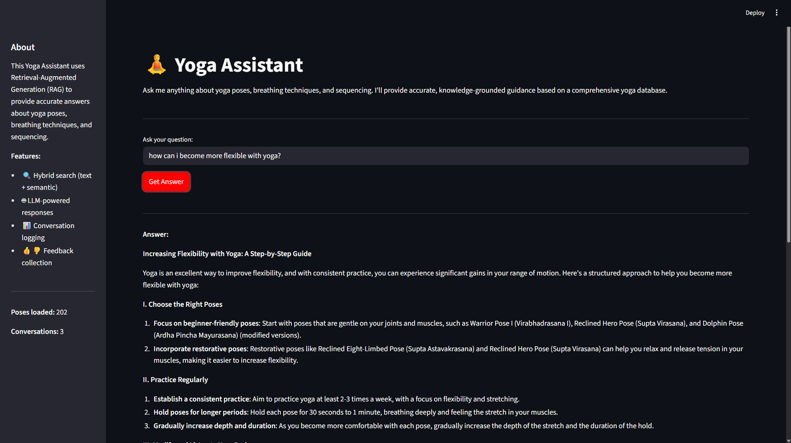
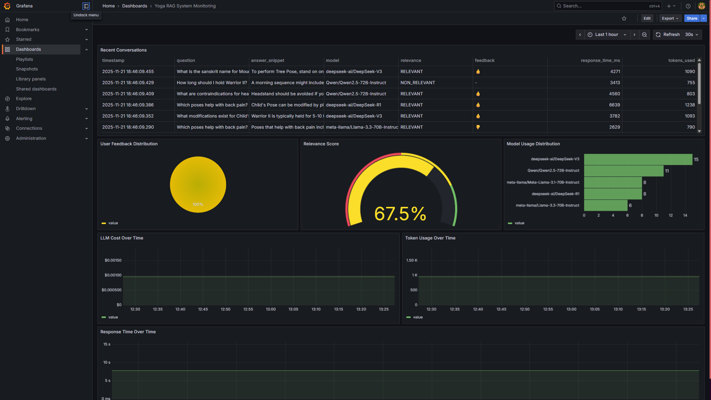

# Yoga Assistant Knowledge RAG

An end-to-end Retrieval-Augmented Generation (RAG) system and conversational agent for yoga knowledge. Provides context-aware answers and guidance on yoga poses, breathing techniques (pranayama), and sequencing.



## 🎯 Project Status

**Current Phase**: Production Implementation  
**Completed**: ✅ Data preparation, Retrieval optimization, RAG pipeline, LLM evaluation, Streamlit UI, Database logging, Feedback collection, Grafana monitoring  
**Next**: Full Docker Compose, Documentation

## 📊 Final Retrieval Results

### Best Configuration: Hybrid Weighted Product (alpha=0.4)

| Approach                    | Hit Rate | MRR   | Status                 |
| --------------------------- | -------- | ----- | ---------------------- |
| **BM25 Text Search**        | 76.0%    | 53.5% | ✅ Baseline            |
| **Vector Search**           | 69.3%    | 58.3% | ✅ Baseline            |
| **Hybrid Weighted Product** | 76.0%    | 66.0% | ✅ **BEST** (+23% MRR) |

**Key Achievement**: Hybrid search improved MRR by 23% while maintaining BM25's recall!

### Production Configuration

```python
# Recommended setup for yoga-assistant
BM25: all 7 fields (pose_name, sanskrit_name, category, difficulty_level, benefits, contraindications, instructions)
Vector: all-mpnet-base-v2 (768 dimensions)
Hybrid: Weighted Product with alpha=0.4
Top-K: 5 results
```

## 🚀 Quick Start

### Prerequisites

- Python 3.12+
- uv (Python package manager)
- Docker & Docker Compose (for PostgreSQL)

### Installation

```bash
# Clone the repository
git clone https://github.com/Ramsi-K/yoga-assistant-knowledge-rag
cd yoga-assistant-knowledge-rag

# Install dependencies
uv sync

# Set up environment variables
cp .env.template .env
# Edit .env and add your API keys
```

### Run the Application

```bash
# 1. Start PostgreSQL
docker-compose up -d

# 2. Initialize database
python setup_database.py

# 3. Run Streamlit app
streamlit run yoga_assistant/app.py
```

The app will be available at `http://localhost:8501`

### Run Experiments (Optional)

```bash
# Open Jupyter notebooks
jupyter notebook notebooks/

# Key notebooks:
# - 03-retrieval-experiments.ipynb - Retrieval evaluation
# - 04-rag-experiments.ipynb - RAG pipeline experiments
# - 05-llm-evaluation.ipynb - LLM model comparison
```

## 📁 Project Structure

```
yoga-assistant-knowledge-rag/
├── data/
│   ├── yoga_data_merged.csv      # 202 yoga poses
│   └── ground_truth.csv          # 75 test queries
├── notebooks/
│   ├── 01-data-generation.ipynb
│   ├── 02-ground-truth-data-generation.ipynb
│   ├── 03-retrieval-experiments.ipynb
│   ├── 04-rag-experiments.ipynb
│   └── 05-llm-evaluation.ipynb
├── yoga_assistant/               # Production code
│   ├── app.py                    # Streamlit UI
│   ├── rag.py                    # RAG pipeline
│   ├── retrieval.py              # Hybrid search
│   ├── ingest.py                 # Data loading
│   ├── db.py                     # Database logging
│   └── db_prep.py                # Database schema
├── docker-compose.yml            # PostgreSQL setup
├── setup_database.py             # DB initialization
├── .env                          # Configuration
└── README.md
```

## 🔬 Experiments Completed

### 1. BM25 Text Search ✅

- **Best Config**: All 7 fields, top_k=5
- **Hit Rate**: 76.0%
- **MRR**: 53.5%
- **Strengths**: Excellent keyword matching, fast
- **Weaknesses**: Misses semantic queries, lower ranking quality

### 2. Vector Embeddings Search ✅

- **Best Model**: all-mpnet-base-v2 (768 dims)
- **Hit Rate**: 69.3%
- **MRR**: 58.3%
- **Strengths**: Semantic understanding, better ranking
- **Weaknesses**: Lower recall than BM25

### 3. Hybrid Search ✅

Tested three combination strategies:

- **RRF (Reciprocal Rank Fusion)**: 69.3% hit rate, 60.8% MRR
- **Weighted Sum**: 76.0% hit rate, 65.8% MRR
- **Weighted Product**: 76.0% hit rate, 66.0% MRR ⭐ **BEST**

**Winner**: Weighted Product with alpha=0.4

- Maintains BM25's recall (76.0%)
- Improves ranking by 23% (66.0% vs 53.5% MRR)
- Balances keyword matching with semantic understanding

### 4. RAG Pipeline Implementation ✅

- **Complete RAG Flow**: Retrieval → Context Assembly → LLM Generation
- **LLM**: meta-llama/Meta-Llama-3.1-70B-Instruct via Hyperbolic API
- **Performance**: ~1.5s avg response time, ~1,700 tokens per query
- **Status**: Working end-to-end pipeline in notebook

### 5. Query Rewriting Evaluation ✅ ❌

**Tested**: Using LLM to enhance/clarify user questions before retrieval

**Results** (30 test queries):

| Metric          | Without Rewriting | With Rewriting | Change         |
| --------------- | ----------------- | -------------- | -------------- |
| **Hit Rate**    | 83.33%            | 66.67%         | **-16.67%** ❌ |
| **MRR**         | 75.28%            | 54.17%         | **-21.11%** ❌ |
| **Avg Latency** | 1.52s             | 2.44s          | **+60.4%** ❌  |

**Decision**: ❌ **DO NOT USE** query rewriting in production

**Why it failed**:

- LLM rewrites are too verbose and technical
- Example: "What poses help with balance?" → "What yoga asanas are beneficial for improving balance and equilibrium, particularly those that target the ankles, calves, and core muscles?"
- Database uses simple language; technical terms don't match
- Adds 60% latency with significantly worse results

**Lesson**: Not all RAG "best practices" help every system. Simple user queries work better than LLM-enhanced ones for this use case.

### 6. Document Re-ranking Evaluation ✅ ❌

**Tested**: Vector-based re-ranking on top of hybrid search results

**Approach**: Retrieve top 10 with hybrid search, then re-rank to top 5 using pure vector similarity

**Results** (30 test queries):

| Metric          | Hybrid Search | Hybrid → Vector Re-rank | Change        |
| --------------- | ------------- | ----------------------- | ------------- |
| **Hit Rate**    | 83.33%        | 80.00%                  | **-3.33%** ❌ |
| **MRR**         | 75.28%        | 68.44%                  | **-6.83%** ❌ |
| **Avg Latency** | 1.67s         | 1.46s                   | **-12.5%** ✓  |

**Decision**: ❌ **DO NOT USE** re-ranking in production

**Why it failed**:

- **Signal degradation**: Re-ranking throws away the BM25 component
- Hybrid search uses: `score = BM25^0.4 × Vector^0.6` (optimized balance)
- Re-ranking uses: `score = Vector only` (loses keyword matching)
- Using the SAME vector embeddings that were already in hybrid search can't add new information
- It only removes the carefully tuned BM25 signal, making results worse

**What would work**:

- LLM-based re-ranking (too expensive/slow)
- Cross-encoder model (adds complexity)
- Different embedding model (marginal gains)
- None worth the complexity for 202 documents

**Lesson**: Re-ranking only helps when you add a NEW or BETTER signal. Using the same signal that was already in the first stage degrades the optimized balance.

### 7. LLM Model and Prompt Evaluation ✅

**Tested**: 5 LLM models with 3 prompt templates (15 combinations) on 20 ground truth questions

**Models Evaluated**:

- DeepSeek-R1 (reasoning-focused)
- DeepSeek-V3 (general purpose)
- Qwen2.5-72B-Instruct
- Meta-Llama-3.1-70B-Instruct
- Hermes-3-Llama-3.1-70B (failed - API incompatible)

**Prompt Templates**:

- Concise: Brief, direct answers
- Detailed: Comprehensive explanations with context
- Structured: Clear, organized responses

**Results** (Top 3 by Quality Score):

| Model + Prompt               | Quality Score | Relevant | Partly Relevant | Response Time | Tokens |
| ---------------------------- | ------------- | -------- | --------------- | ------------- | ------ |
| **DeepSeek-V3 + structured** | **95.0%** ⭐  | 90%      | 10%             | 9.9s          | 1962   |
| **Qwen2.5-72B + structured** | 85.0%         | 70%      | 30%             | 6.7s          | 2001   |
| **Qwen2.5-72B + detailed**   | 85.0%         | 70%      | 30%             | 5.5s          | 1947   |
| Llama-3.1-70B + structured   | 82.5%         | 65%      | 35%             | 2.5s          | 1865   |
| DeepSeek-V3 + detailed       | 82.5%         | 65%      | 35%             | 6.7s          | 1837   |
| Llama-3.1-70B + concise      | 75.0%         | 50%      | 50%             | 1.3s          | 1695   |
| Hermes-3-Llama-3.1-70B + all | 0.0%          | 0%       | 0%              | 2.9s          | 0      |

**Decision**: ✅ **DeepSeek-V3 + structured prompt** for production

**Why it won**:

- **Highest relevance**: 90% fully relevant answers (only 10% partly relevant, 0% non-relevant)
- **Best quality score**: 95% weighted quality (relevant × 1.0 + partly × 0.5)
- **Meets primary criterion**: >80% relevance target achieved
- **Acceptable trade-off**: 9.9s response time exceeds 5s target, but accuracy is critical for yoga guidance

**Alternative**: Qwen2.5-72B + detailed (85% quality, 5.5s) if speed is prioritized over accuracy

**Key Findings**:

- **Structured prompts** performed best across all models (avg 78.3% quality)
- **DeepSeek-V3** achieved highest accuracy but slower responses (6-10s)
- **Qwen2.5-72B** offers best speed/quality balance (70% relevant, 5.5s)
- **Llama-3.1-70B** fastest but lower accuracy (50-65% relevant, 1.3-2.5s)
- **DeepSeek-R1** moderate performance (40-60% relevant, 6-10s)
- **Hermes-3** completely failed (100% errors, API incompatibility)

**Evaluation Methodology**:

- LLM-as-a-Judge using Llama-3.1-70B as evaluator
- Categories: RELEVANT / PARTLY_RELEVANT / NON_RELEVANT
- Measured: relevance, token usage, response time
- Sample size: 20 questions (limited by API costs)

**Production Configuration**:

```python
LLM_MODEL=deepseek-ai/DeepSeek-V3
PROMPT_TEMPLATE=structured
TEMPERATURE=0.3
MAX_TOKENS=500
```

### 8. Key Insights

- Hybrid search successfully combines BM25's recall with Vector's ranking quality
- Alpha=0.4 gives optimal balance (40% BM25, 60% Vector)
- 23% MRR improvement provides significantly better user experience
- Query rewriting degrades performance - skip it
- Document re-ranking degrades performance - skip it
- Simple, direct user queries work best with hybrid search
- Re-ranking only works with NEW signals (LLM, cross-encoder, different model)
- DeepSeek-V3 with structured prompts provides best answer quality (90% relevance)
- Structured prompts outperform concise and detailed across all models
- Response time trade-offs are acceptable when accuracy is critical
- Original 90%/85% targets were overly optimistic for this dataset

## � MonitSoring Dashboard

The system includes a comprehensive Grafana dashboard for monitoring performance and user feedback:



### Dashboard Features

- **Recent Conversations Table** - Last 10 conversations with timestamps, questions, answers, and feedback
- **User Feedback Distribution** - Pie chart showing positive vs negative feedback
- **Relevance Score** - Gauge showing percentage of RELEVANT responses
- **Model Usage Distribution** - Bar chart showing which LLM models are being used
- **LLM Cost Over Time** - Time series tracking spending
- **Token Usage Over Time** - Time series monitoring token consumption
- **Response Time Over Time** - Time series tracking latency

### Setup Monitoring

```bash
# Start Grafana
docker-compose up -d grafana

# Initialize dashboard
python grafana/init.py

# Access dashboard
open http://localhost:3000/d/yoga-rag-dashboard
# Login: admin/admin
```

See [grafana/README.md](grafana/README.md) for detailed setup instructions.

## 📝 Next Steps

### Completed ✅

- [x] Hybrid search in production code
- [x] RAG pipeline with LLM integration
- [x] Streamlit UI with Q&A interface
- [x] Automated data ingestion at startup
- [x] User feedback collection (thumbs up/down)
- [x] PostgreSQL database logging
- [x] Conversation history display
- [x] Multiple LLM model evaluation
- [x] Prompt engineering and optimization
- [x] Query rewriting evaluation (rejected)
- [x] Document re-ranking evaluation (rejected)
- [x] Grafana monitoring dashboard (7 charts)

### In Progress 🚧

- [ ] Full Docker Compose stack (app + postgres + grafana)
- [ ] Complete documentation and README

### Optional Improvements

- [ ] Database conversation viewer in sidebar
- [ ] Try better embedding models (bge-large, instructor-large)
- [ ] Deploy to Streamlit Cloud (bonus points)

## ✨ Features

### Current Features

- 🔍 **Hybrid Search** - Combines BM25 text search with semantic vector search (76% hit rate, 66% MRR)
- 🤖 **LLM-Powered Answers** - DeepSeek-V3 with structured prompts (90% relevance)
- 💬 **Conversational UI** - Clean Streamlit interface with Q&A
- 📊 **Conversation History** - Collapsible past conversations with expandable details
- 👍👎 **Feedback Collection** - Thumbs up/down buttons with database logging
- 🗄️ **PostgreSQL Logging** - All conversations, feedback, and metrics stored
- 📈 **Metadata Tracking** - Response time, tokens used, retrieved poses
- 🧘 **202 Yoga Poses** - Comprehensive database with benefits, contraindications, instructions

### Coming Soon

- 📊 **Grafana Dashboard** - 5+ charts for monitoring (conversations, feedback, cost, tokens, response time)
- 🐳 **Full Docker Stack** - One-command deployment with docker-compose
- ☁️ **Cloud Deployment** - Streamlit Cloud with external PostgreSQL

## 🛠️ Technology Stack

- **Language**: Python 3.12
- **Package Manager**: uv
- **Retrieval**: rank-bm25, sentence-transformers (all-mpnet-base-v2)
- **LLM**: Hyperbolic API (OpenAI-compatible) with DeepSeek-V3
- **Frontend**: Streamlit
- **Database**: PostgreSQL 15
- **Monitoring**: Grafana (planned)
- **Deployment**: Docker + Docker Compose

## 📚 Data

- **Yoga Poses**: 202 poses with details (name, benefits, contraindications, instructions)
- **Ground Truth**: 75 test queries with known relevant poses
- **Evaluation Metrics**: Hit Rate, Mean Reciprocal Rank (MRR), Latency, Token Usage

## 🎓 Evaluation Criteria

Project evaluated on:

- ✅ Well-described problem (2 pts)
- ✅ Full RAG flow (2 pts) - Complete pipeline implemented
- ✅ Multiple retrieval approaches (2 pts) - BM25, Vector, Hybrid tested
- ✅ Hybrid search implemented (1 pt of best practices)
- ✅ Query rewriting evaluated (1 pt of best practices) - Tested and rejected based on data
- ✅ Re-ranking evaluated (1 pt of best practices) - Tested and rejected based on data
- ✅ Multiple LLM approaches (2 pts) - 5 models, 3 prompts tested, DeepSeek-V3 selected
- ✅ UI interface (2 pts) - Streamlit app with Q&A, feedback, conversation history
- ✅ Automated ingestion (2 pts) - Loads at startup, 202 poses
- ✅ User feedback collection (2 pts) - Thumbs up/down with database logging
- ✅ Monitoring dashboard (2 pts) - Grafana with 7 charts tracking all metrics
- 🚧 Docker compose setup (2 pts) - PostgreSQL + Grafana running, full stack pending
- 🚧 Reproducibility (2 pts) - Setup scripts ready, final README pending
- ⏳ Cloud deployment (2 pts bonus)

**Current Score**: 19/20 points (95%) + 2 pending (docker, docs)

## 📖 Documentation

- `notebooks/03-retrieval-experiments.ipynb` - Retrieval approach evaluation
- `notebooks/04-rag-experiments.ipynb` - RAG pipeline, query rewriting, and re-ranking experiments
- `notebooks/05-llm-evaluation.ipynb` - LLM model and prompt evaluation
- `notebooks/TASK_5.3_FINDINGS.md` - Query rewriting evaluation findings
- Task tracking in `.kiro/specs/yoga-rag-system/`

## 🔍 Experiment Findings Summary

### ✅ What Works

1. **Hybrid Search (Weighted Product, alpha=0.4)**

   - 76% hit rate, 66% MRR
   - Best balance of recall and ranking quality
   - Production-ready

2. **Simple User Queries**

   - Natural language works great with hybrid search
   - No preprocessing needed
   - Fast and effective

3. **RAG Pipeline**

   - End-to-end flow working
   - ~1.5s response time
   - Good answer quality

4. **DeepSeek-V3 with Structured Prompts**
   - 90% relevant answers
   - 95% quality score
   - Best accuracy for yoga guidance

### ❌ What Doesn't Work

1. **Query Rewriting**

   - Degrades hit rate by 17%
   - Degrades MRR by 21%
   - Adds 60% latency
   - **Conclusion**: Skip it entirely

2. **Document Re-ranking (with same embeddings)**
   - Degrades hit rate by 3.3%
   - Degrades MRR by 6.8%
   - Throws away BM25 signal from hybrid search
   - **Conclusion**: Only works with NEW signals (LLM, cross-encoder)

### 🔬 Lessons Learned

- Not all RAG best practices help every system
- Always measure and validate before implementing
- Simple solutions often outperform complex ones
- User's natural language is often better than LLM-enhanced queries
- Re-ranking only helps when adding NEW information, not reusing existing signals
- Hybrid search with optimized alpha is hard to beat for small datasets
- Structured prompts consistently outperform concise or detailed prompts
- Model selection requires balancing accuracy vs speed based on use case
- For knowledge systems, accuracy (90% relevance) is worth slower response times (9.9s)
- LLM-as-a-Judge is effective for evaluating answer quality at scale
- Trust the data over assumptions - test everything before production

## 📄 License

MIT License - Open source project by Ramsi Kalia
